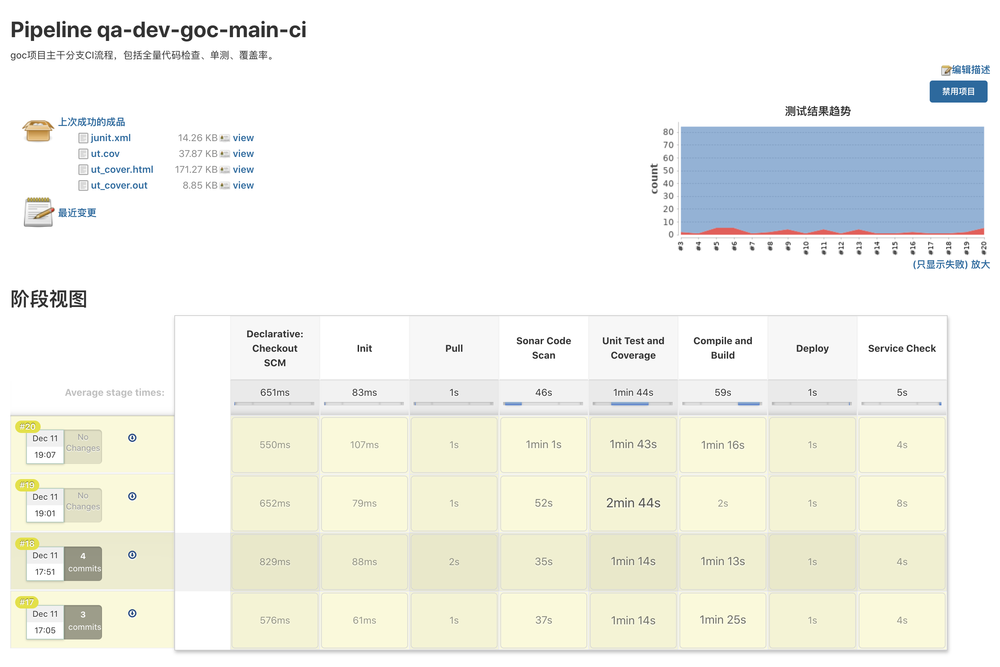
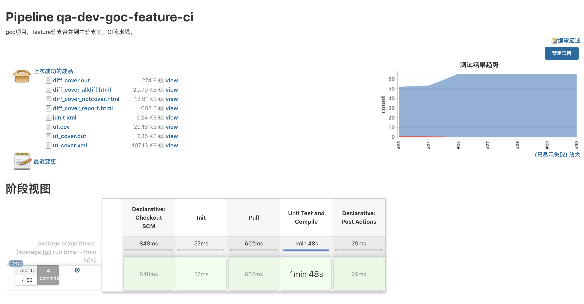
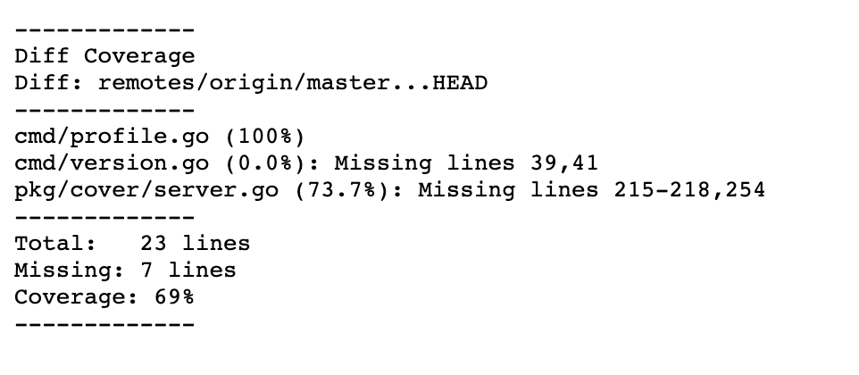
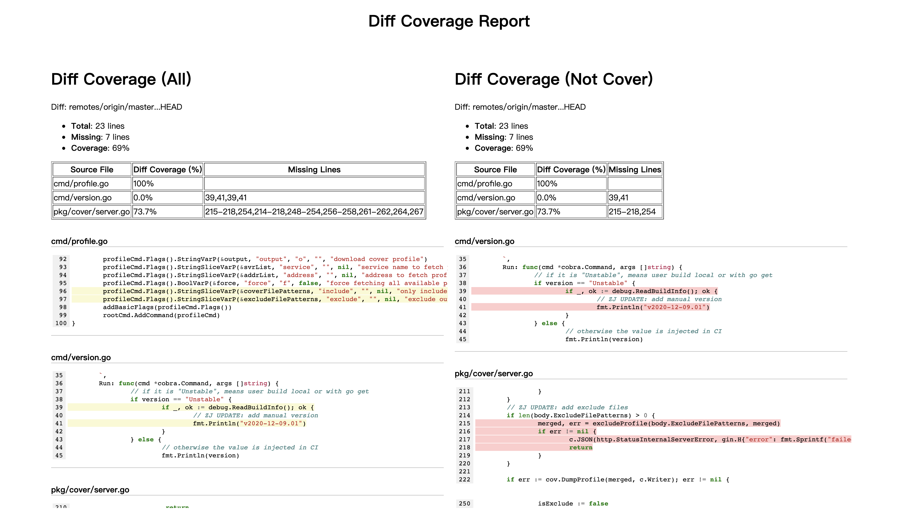

# CICD

## 分支模型

### 旧分支模型 - feature发布

- dev: 开发调试、自测
- test: 开发完成后合入、集成测试
- uat: 双周，基于版本统一合入，local验收测试
  - 脚本检查jira单及mr（踢出不合规需求），合入版本需求
  - uat发布过程人工介入，可插入临时需求
  - 并行服务发布
- master: 单周，单个feature合入后发布
  - master分支拉出一个临时release分支，合入feature分支，解决代码冲突（原因：1.master分支权限问题；2.在临时分支上操作安全）
  - release合回master分支，添加tag并执行发布
  - 对于紧急版本，直接从master分支拉出feature分支进行开发，完成后合入master分支，发布

优点：

1. 因为可插入临时需求，能够保证要上线的需求发布到uat环境，后端和移动端有明确的需求输入
2. 基于单feature发布，1）当发布上有依赖时，可拆分为更小粒度，按顺序执行；2）上线风险较小，回滚操作简单

缺点：

1. uat与master分支代码不一致
2. 没有预发布环境来执行全量回归测试
3. QA介入较多，如推动开发解决代码合入冲突

### 新分支模型 - 版本发布

- dev: 开发调试、自测
- test: 开发完成后合入，集成测试
- uat: 一周两次，基于版本统一合入，local验收测试
  - uat需求 scope cutoff 和 code freeze 检查，不合规需求会被踢出
  - 严格控制临时需求
  - 并行服务发布
- master: 单周
  - 由开发合入mr
  - 上线需求 scope cutoff 和 code freeze 检查
  - scope cutoff 确定版本需求范围，code freeze 确定版本代码范围
- staging: 从master分支合入，预发布环境，执行全量回归测试
- release: 从staging分支合入，添加tag, 基于版本发布

> 理论上 master, stating, release 分支一致。
>
> 版本发布：包括多个repo的多个feature. 多个服务按顺序发布，无依赖的服务可并行发布。

优点：

1. 由开发完成mr的合入
2. staging与master分支一致，上线前会经过全量回归测试
3. 严格执行 scope cutoff 和 code freeze 检查，过程可做到自动化，较少人工介入

> 减少人工投入，和线上质量。

缺点：

1. 基于版本发布，服务发布顺序问题，及多个服务发布时处理问题复杂

### tag 版本号

常规版本格式：`{module}-v{major}.{minor}.{patch}`
Hotfix and Ad hoc 紧急版本格式：`{module}-v{major}.{minor}.{patch}-{type}`

例子：

```text
current version: rm-v1.2.0
next regular: rm-v1.3.0
next adhoc after regular: rm-v1.3.1-adhoc
next hotfix after regular: rm-v1.3.1-hotfix
```

> 规则简单的版本号可做自增。在release发布时，当前版本号可以基于上一个tag版本做自增。

### 问题

1. 协调前后端发布时间
  - 后端先发布
  - 前端接口向前兼容
  - 回归测试包括api和e2e测试

2. 多个服务的多个feature发布
  - 需求与代码冻结（临时增减上线需求）
  - 服务发布顺序

3. 当前dev需要把feature分别合入到uat和master分支，有两次合入操作
  - 完成uat的需求不一定会合入到master分支
    - 前提：完成uat的需求大概率会合入到master分支
    - 将不合入到uat的需求去掉，之后将uat合入master分支
    - 合入顺序：feature -> uat <-> master <-> staging <-> release（开发只需一次合入操作）
  - local uat signoff 时间不确定
    - 从uat分支 cherrypick 要发布的需求到staging分支。（FIX: cherrypick 可能会导致mr合入顺序不一致，引起额外的代码冲突）
    - 保证uat分支与release分支同步

## UAT 发布pipeline

Jenkins pipeline定义：

`jenkins pipeline -> stages + grovvy -> jenkins job -> python script`

Pipeline stages:
- create release ticket
- feature branch rebase
- tickets verify and remove
- merge to uat
- deploy to uat (parallel)
- send notification

Jenkins pipeline优化：

`jenkins pipeline -> stages + grovvy + sh -> python script`

## Live 发布工具

### 功能

1. 调用 jira api, 收集jira单信息及状态更新，梳理 user story, epic, task 和 mr 关系
2. 通过 jira webhook, 检查jira单及关联mr的状态
3. 通过 gitlab api 收集mr信息，执行mr合入及tag操作
4. 通过 gitlab webhook 和 pipeline, 检查mr及关联的jira单状态
5. 服务依赖关系及发布checklist检查
6. 通过 jenkins api 执行服务发布pipeline
7. 通知与报告
  - jira单状态检查 `user story => task => mr`
  - 服务部署顺序 `service (repo) => task => mr`

### Data and Models

Data flow:

- `release cycle -> dev tasks -> linked with release ticket`
- `dev task -> MR -> repo -> service`
- `dev task -> user story`

> Release Ticket use as db, and track the whole Cutoff, Code freeze and Deploy process.

Data models:

```python
# ref data
# service
{
  "name": "name",
  "repo_url": "url",
  "module": "module-name",
  "deploy_pipelines": [
    "pipeline1", "pipeline2",
  ]
  "dependencies": [
    "service_name1", "service_name2",
  ],
}

# services
[
  Service1,
  Service2,
]

# run data
# user story
{
  "user_story_id": "jira-id",
  "status": "staging",
  "linked_tasks": [
    "jira-id1", "jira-id2",
  ],
  "verify_pass": False,
  "verify_failed_message": "child task [jira-id] verify failed.",
}

# task
{
  "task_id": "jira-id",
  "user_story_id": "jira-id",
  "master_release_ticket": "jira-id",
  "status": "staging",
  # 只关注目标分支为master的mr
  "linked_mrs": [
    "mr-id1", "mr-id2",
  ],
  "region": "all,vn,th",
  "type": "BE,FE,Android,IOS",
  "release_cycle": "2021.01.v1",
  "release_status": "InScope-Merged",
  "has_it": True,
  "has_uat": True,
  "is_blocked_by": [
    "jira-id1", "jira-id2",
  ],
  "release_checklist": [
    "db",
  ],
  "verify_pass": False,
  "verify_failed_message": "no it/uat results.",
}

# mr
{
  "mr_id": "mr-id",
  "url": "request-url",
  "status": "merged",
  "repo": "repo-url",
  "src_branch": "feature",
  "dst_branch": "master",
  "linked_task": [
    "jira-id1", "jira-id2",
  ],
  "service": "service-name",
  "verify_pass": False,
  "verify_failed_message": "mr title format error.",
}

# release cycle 一个发布流程
{
  "value": "2021.01.v2",
  "phrase": "Scope Cutoff",
  "start_date": "2020-06-04",
  "release_date": "2020-06-01",
  "user_stroies": {  # dict
    "user_story_id1": UserStory1,
    "user_story_id2": UserStory2,
  },
  "tasks": {
    "task_id1": Task1,
    "task_id2": Task2,
  },
  "git_mrs": {
    "mr_id1": GitMRs1,
    "mr_id2": GitMRs2,
  },
  "deploy_be_services": [
    "module1": [
      { "service": BeService2, "region": "vn,th"},
      { "service": BeService1, "region": "vn"},
    ],
  ],
  "deploy_fe_services": [
    "admin": [
      { "service": FeService2, "region": "all"},
      { "service": FeService1, "region": "all"},
    ]
  ],
  "ordered_deploy_be_services": [
    "module1": [
      { "service": BeService1, "region": "vn"},
      { "service": BeService2, "region": "vn,th"},
    ],
  ],
  "ordered_deploy_fe_services": [
    "admin": [
      { "service": FeService1, "region": "all"},
      { "service": FeService2, "region": "all"},
    ]
  ],
}
```

### Rest APIs of workflow

Pre-Cutoff:

1. `release_cycle/create`
  - reg and irreg release cycle will be available
  - master tickets for regular and irregular release cycle will be created
2. `release_cycle/regular/start`
3. `release_cycle/emergency/start`

Scope cutoff:

1. `cutoff/prescreening`
2. `cutoff/execute`
  - move "Pending - Failed Verification" tickets to "Rejected - Failed Verification"
  - remove release cycle
  - generate cut off report
3. `ticket/get`
  - to obtain all in-scope tickets
  - to regenerate cut off report

Code freeze:

1. `code_freeze/prescreening`
  - "In-scope - Pending Merge" tickets that have not linked to a master branch MR
  - report contains all tickets that have sign off but it's not signed off by official QA (Eg: signed off by dev themselves)
  - report contains extra merge, open merge, update status issues
2. `code_freeze/execute`
  - move "In-scope - Pending Merge" tickets to "Rejected - Miss Out Merge"
  - generate code freeze report
3. `scope/get_repo`
  - report contains all repos that contain code changes

Staging deploy:

1. `scope/tag_repo`
  - create auto mr from master to staging for all repos
  - generate auto tag once auto MR is merged
2. `release_cycle/regular/start`
  - enable the next release cycle
  - devs to start merging following weeks MR

Live deploy:

1. `scope/get_repo`
2. `scope/tag_repo`
  - from staging to release
3. `ticket/update_to_released`
  - move ticket status from Regression/Delivering to Done
  - move release status from "In-scope - Merged" to "Released"
4. `release_cycle/emergency/start`
  - enable next week emergency release cycle

## Golang cicd 流程

### 主干分支

Jenkins pipeline:



检查点：

1. 代码扫描
2. 单元测试 -> 单测覆盖率
3. API测试 -> 集成测试覆盖率
4. 服务部署完成后的线上检查

输出：

- `junit.xml`: 单元测试结果
- `ut_cover.out`: 全量的函数覆盖率报告
- `ut_cover.html`: 全量的行覆盖率报告

### Feature 分支

Jenkins pipeline:



检查点：

1. 单元测试
2. 增量代码 -> 增量覆盖率
3. go反向调用链分析（精准测试）

输出：

- `diff_cover.out`: 增量的函数覆盖率报告



- `diff_cover_report.html`: 增量的行覆盖率报告



`diffcover`工具生成的增量覆盖率报告只显示未被覆盖的行，参考 `srccode/diff_cover_patch` 同时显示 增量代码+未被覆盖的行。

> 增量覆盖率数据基于 单测+全量覆盖率数据+diffcover 生成。

